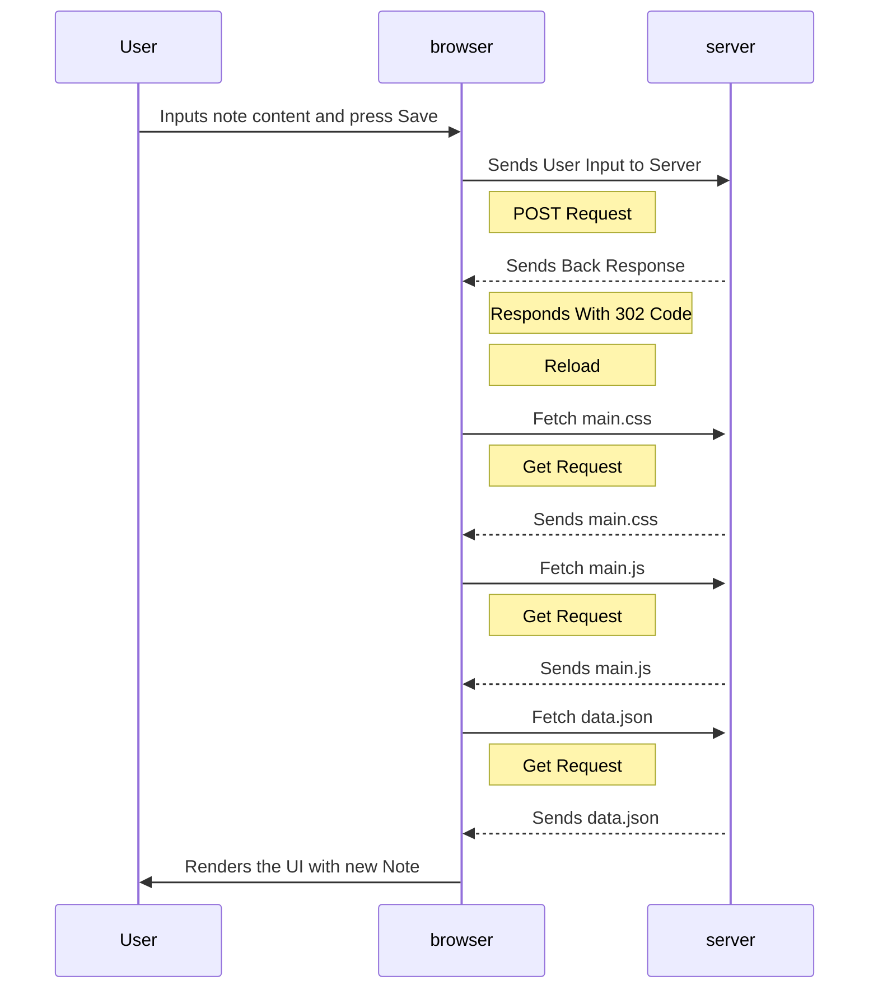

```mermaid
sequenceDiagram
    participant User
    participant browser
    participant server

    User->>browser: Inputs note content and press Save
    browser->>server: Sends User Input to Server
    NOTE right of browser: POST Request
    activate server
    server-->>browser: Sends Back Response
    note right of browser: Responds With 302 Code
    note right of browser: Reload

    browser->>server: Fetch main.css
    note right of browser: Get Request
    server-->>browser: Sends main.css

    browser->>server: Fetch main.js
    note right of browser: Get Request
    server-->>browser: Sends main.js

    browser->>server: Fetch data.json
    note right of browser: Get Request
    server-->>browser: Sends data.json

    browser->>User: Renders the UI with new Note


```