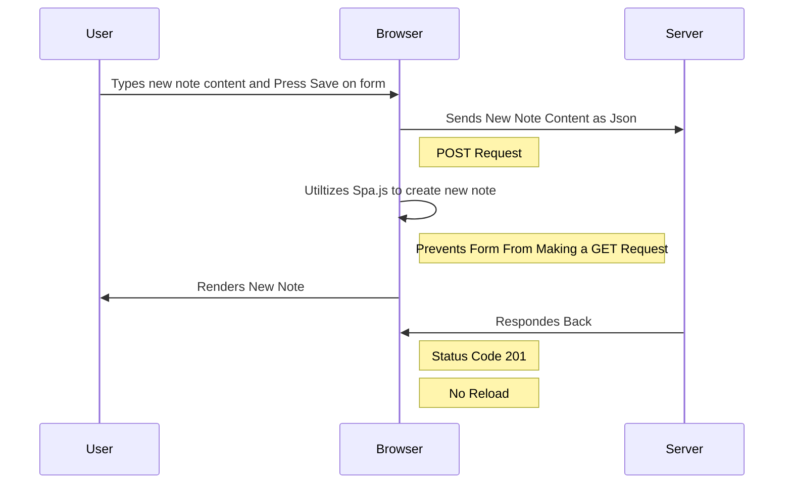

```mermaid
sequenceDiagram

participant User
participant Browser
participant Server

User->>Browser: Types new note content and Press Save on form
Browser->>Server: Sends New Note Content as Json
note right of Browser: POST Request

Browser->>Browser: Utiltizes Spa.js to create new note
note right of Browser: Prevents Form From Making a GET Request

Browser->>User: Renders New Note


Server->>Browser: Respondes Back
note right of Browser: Status Code 201
note right of Browser: No Reload

```