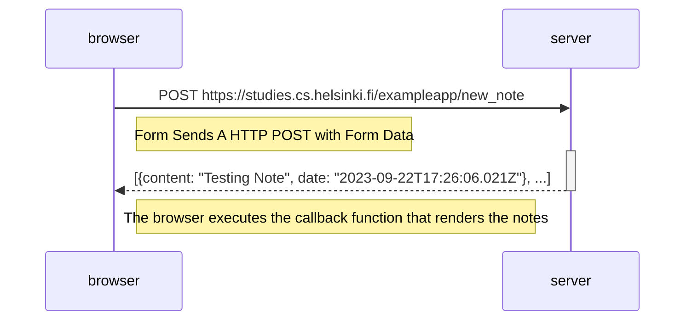
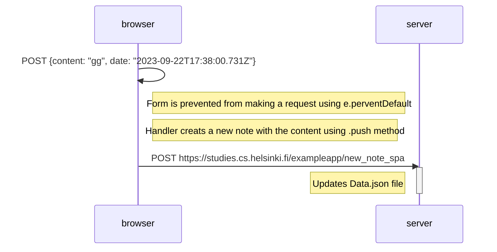

# Form Post Request Traditonal Way

```mermaid
sequenceDiagram

    participant browser
    participant server

    browser->>server: POST https://studies.cs.helsinki.fi/exampleapp/new_note
    NOTE right of browser: Form Sends A HTTP POST with Form Data
    activate server
    server-->>browser: [{content: "Testing Note", date: "2023-09-22T17:26:06.021Z"}, ...]
    deactivate server

    Note right of browser: The browser executes the callback function that renders the notes

```

# Form Post Request In SPA

```mermaid
sequenceDiagram

    participant browser
    participant server

    browser->>browser: POST {content: "gg", date: "2023-09-22T17:38:00.731Z"}
    NOTE right of browser: Form is prevented from making a request using e.perventDefault
    NOTE right of browser: Handler creats a new note with the content using .push method

    browser->>server: POST https://studies.cs.helsinki.fi/exampleapp/new_note_spa
    activate server
    Note left of server: Updates Data.json file
    deactivate server 
```