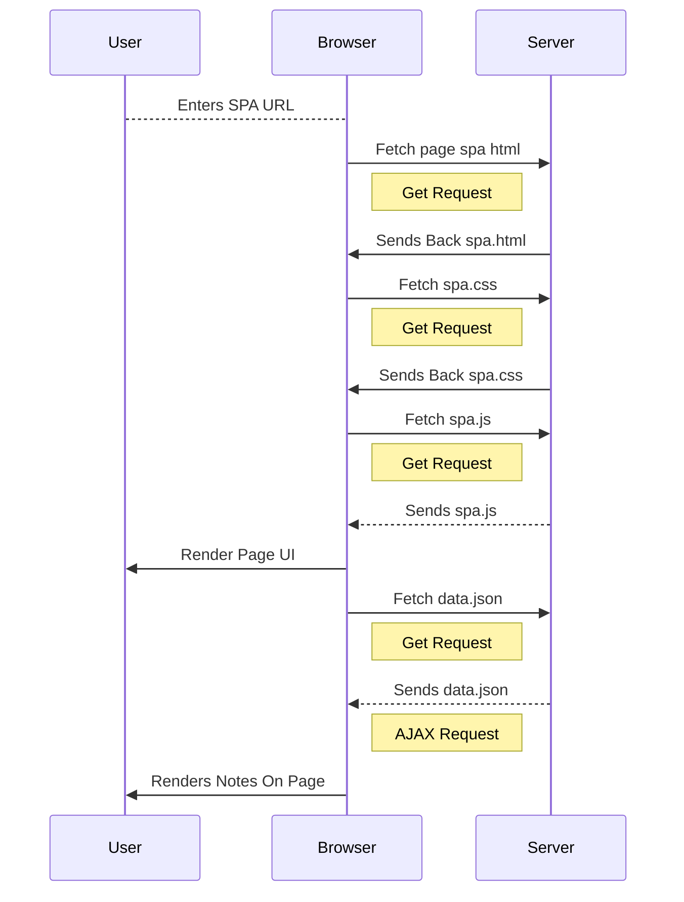

```mermaid
sequenceDiagram


participant User
participant Browser
participant Server

User-->Browser: Enters SPA URL

Browser->>Server: Fetch page spa html
note right of Browser: Get Request
Server->>Browser: Sends Back spa.html

Browser->>Server: Fetch spa.css
note right of Browser: Get Request
Server->>Browser: Sends Back spa.css

Browser->>Server: Fetch spa.js
note right of Browser: Get Request
Server-->>Browser: Sends spa.js

Browser->>User: Render Page UI

Browser->>Server: Fetch data.json
note right of Browser: Get Request
Server-->>Browser: Sends data.json
note right of Browser: AJAX Request

Browser->>User: Renders Notes On Page


```